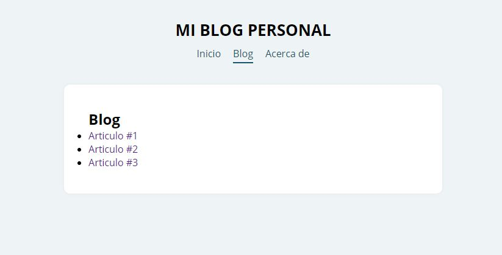

# Acerca De
Este es un proyecto de estudio donde se practicó el uso de router mediante el browserRouter y el switch router.

Se hizo una navegación para ir a las diferentes páginas y al mismo tiempo se realizo páginas internas para el blog obteniendo los datos de los artículos mediante un json 

